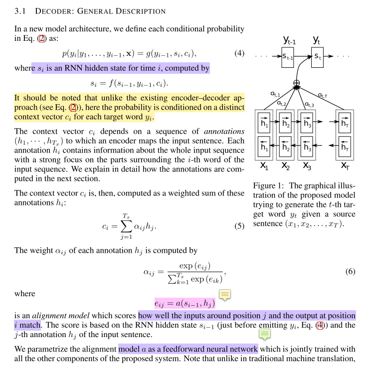
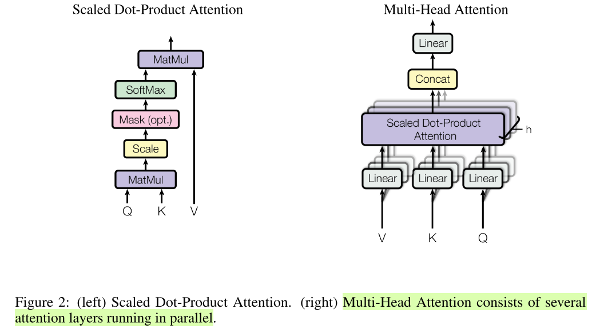

## Attention机制的作用
* 减少处理高维输入数据的计算负担,结构化的选取输入的子集,从而降低数据的维度。
* 让系统更加容易的找到输入的数据中与当前输出信息相关的有用信息,从而提高输出的质量。
* 帮助类似于decoder这样的模型框架更好的学到多种内容模态之间的相互关系。

* soft attention（矩阵相乘或者网络参数学习），hard attention（随机化），multi head attention

## Attention出处：
Neural Machine Translation by Jointly Learning to Align and Translate， ICLR 2015, Bengio

Transformer中抛弃了传统的CNN和RNN，整个网络结构完全是由Attention机制组成。更准确地讲，Transformer由且仅由self-Attenion和Feed Forward Neural Network组成。一个基于Transformer的可训练的神经网络可以通过堆叠Transformer的形式进行搭建，作者的实验是通过搭建编码器和解码器各6层，总共12层的Encoder-Decoder，并在机器翻译中取得了BLEU值得新高。