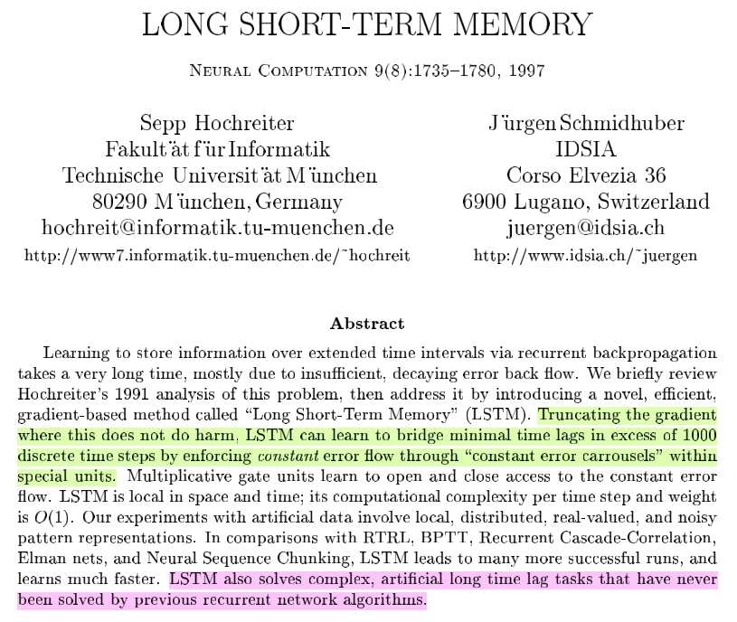

Lstm由输入门,遗忘门,输出门和一个cell组成。第一步是决定从cell状态中丢弃什么信息,然后在决定有多少新的信息进入到cell状态中,最终基于目前的cell状态决定输出什么样的信息。

[RNN梯度消失和爆炸](https://zhuanlan.zhihu.com/p/28687529) 这个写的不错, 含反向传播推导

[LSTM如何缓解梯度消失和爆炸](https://zhuanlan.zhihu.com/p/28749444) --> 公式被缩减部分有错误参照楼上正确版本，但总体思路清晰。

[LSTM反向传播推导硬核](https://www.cnblogs.com/pinard/p/6519110.html)  推导的很到位，清晰见到结论如下：

反响传播更新W的梯度从原始RNN的累乘转变为由门控机制控制的累加。很好的缓解了梯度消失和爆炸的问题哇。2020.10.13。

‘梯度消失’其实在DNN和RNN中意义不一样，DNN中梯度消失指的是误差无法传递回浅层，导致浅层的参数无法更新；而RNN中的梯度消失是指较早时间步所贡献的更新值，无法被较后面的时间步获取，导致后面时间步进行误差更新的时候，采用的只是附近时间步的数据。【即，RNN中参数还是可以更新的，但是没办法满足它最开始的假设，利用到较早信息。】