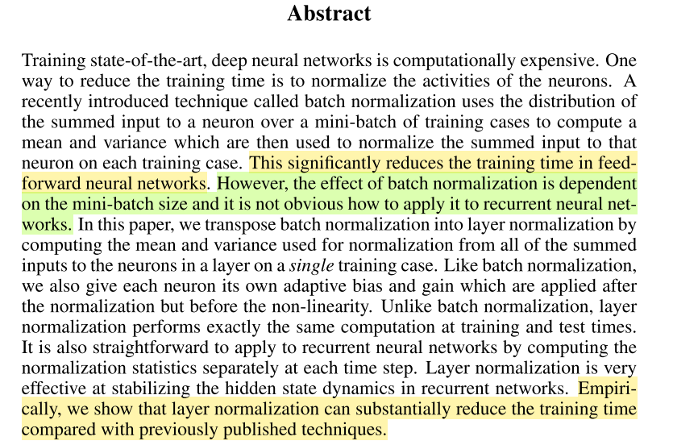

BN适用于不同mini batch数据分布差异不大的情况，而且BN需要开辟变量存每个节点的均值和方差，空间消耗略大；而且 BN适用于有mini_batch的场景。

LN只需要一个样本就可以做normalization，可以避免 BN 中受 mini-batch 数据分布影响的问题，也不需要开辟空间存每个节点的均值和方差。

LN更适合RNN. 因为序列的长度可能不一样。

BN要打乱样本才会好一些，满足原始样本的分布。

## dropout的原理
* 以p的概率保留某个节点，以1-p的概率掩盖掉某一个节点.
* 训练阶段如上，测试阶段每个节点都加入，然后都乘以P.
