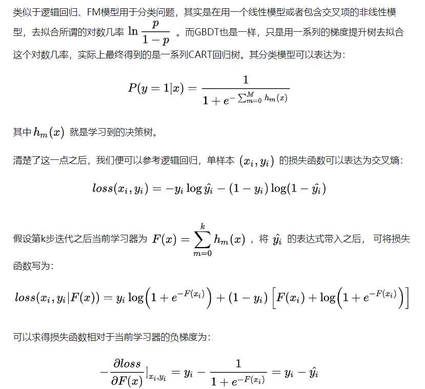
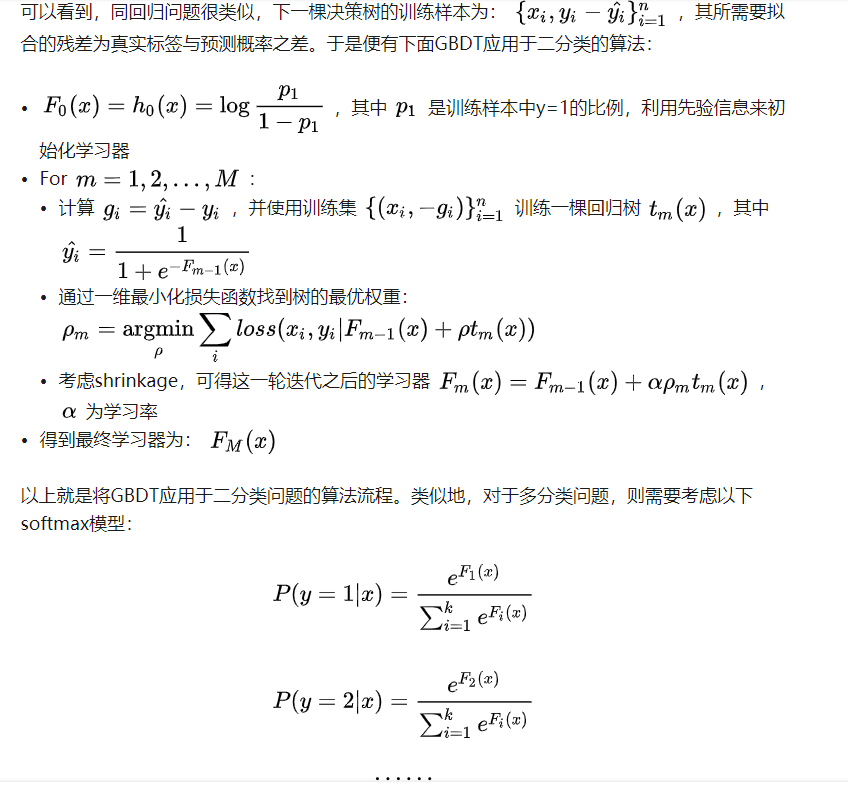

# AdaBoost(Boosting家族)通过调整错分的数据点的权重来改进模型
# GBDT是用负的梯度作为近似残差去拟合模型。（Boosting Tree在回归问题采用平方损失时对应的负梯度即为残差）
* AdaBoost改变了训练数据的权值,即样本的概率分布,减少上一轮被正确分类的样本权值,提高被错误分类的样本权值,而随机森林(RF—> 属于bagging家族,自助采样Bootstrap)在训练每棵树的时候,随机挑选部分训练集进行训练。
* 在对新数据进行预测时,AdaBoost中所有树加权投票进行预测,每棵树的权重和错误率有关,而随机森林对所有树的结果按照少数服从多数的原则进行预测。

## GBDT 采用 CART作为基学习器！ 损失函数只要求一阶可导。
* 分类模型 -->分类模型的损失函数包括有”deviance”和指数损失函数”exponential”，默认为对数损失函数。

* 回归模型 --> 回归模型的损失函数包括均方差”ls”，绝对损失”lad”，Huber损失”huber”，分位数损失”quantile”。

### 对数损失是用于最大似然估计的（交叉熵损失）。

一组参数在一堆数据下的似然值，等于每一条数据在这组参数下的条件概率之积。而损失函数一般是每条数据的损失之和，为了把积变为和，就取了对数。再加个负号是为了让最大似然值和最小损失对应起来。

### 参加李航的《统计学习方法》
* GBDT中当前的树是指加权了所有已经训练好的树。（这和泰勒公式紧密相连，XGBoost展开到二阶导，GBDT只展开到一阶导，并不断迭代收敛）梯度下降法求得下一棵叠加树。参数估计是树的模型（类比NN）。
* 书中省略了学习速率η，以及基学习器DT的学习过程，GBDT中的基学习器决策树采用的是CART算法，以基尼指数作为划分指标。

### [XGBoost和GBDT均是基于CART回归树，对GBDT来说，当预测值为连续值时，计算预测值与真实值之间距离的平方和，均方误差(MSE)是最常用的回归损失函数，此时负梯度刚好是残差，当预测值为离散值，或者说处理分类问题时，拟合的也是‘负梯度’，只是要转一道弯。这道弯是将预测值和真实值转换为类别的概率，迭代过程就是让预测概率不断接近真实概率。](https://www.zhihu.com/question/269929168/answer/576574579)

XGBoost怎么做分类？损失函数是什么（交叉熵损失函数, 指数损失函数等分类损失也可以）。叶子节点取值。

--> 注意sigmoid函数做分类结合交叉熵损失函数的导数就是对应残差. （GBDT叶子节点对应的取值为残差概率，然后在几率的方向上优化得到总的决策为sigmoid函数的映射值。

--> 叶子节点回归权重（sigmoid后对应概率）。[妙啊](https://zhuanlan.zhihu.com/p/46445201)

## 若是K个类则训练K个ensemble Tree.一下是训练流程图：

GBDT无论用于分类还是回归，一直使用的是CART回归树。GBDT不会因为我们所选择的任务是分类任务就选用分类树，这里的核心原因是GBDT每轮的训练是在上一轮训练模型的负梯度值基础之上训练的。