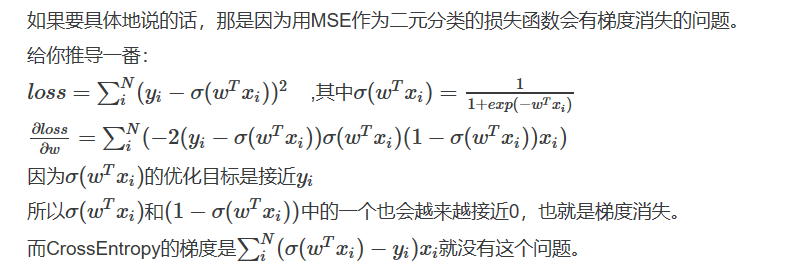

## 逻辑斯蒂回归是一个分类器，神经网络的基础（从线性回归+sigmoid计算概率到似然函数进行模型参数估计，到损失计算）
* **二项逻辑斯蒂回归**是在线性回归模型的基础上，使用*sigmoid*函数，将线性模型 $z =  \mathbf{w}^{T}\mathbf{x}$ 
的结果压缩到[0,1] 之间
$$\sigma(z) = \frac{1}{1+e^{-z}} $$
得到样本x属于标注y=1的概率。针对二分类问题，其概率函数为
$$ P(y=1|\mathbf{x}) = \frac{1}{1 + e^{-(\mathbf{w}^{T}\mathbf{x}+b)}} = \frac{e^{(\mathbf{w}^{T}\mathbf{x}+b)}}{1 + e^{(\mathbf{w}^{T}\mathbf{x}+b)}}$$  
$$ P(y=1|\mathbf{x}) = 1 - P(y=1|\mathbf{x}) =\frac{1}{1 + e^{(\mathbf{w}^{T}\mathbf{x}+b)}}$$

* **事件的几率**是指该事件发生的概率与该事件不发生的概率的比值。如果事件发生的概率是*p*，那么该事件的几率是$\frac{p}{1-p}$，该事件的对数几率(log odds)或logit函数是
$$ logit(p) = log\frac{p}{1-p} $$

为方便描述，我们扩充向量*w,x*,令$\mathbf{w} = (\mathbf{w}^{(1)},\mathbf{w}^{(2)},\dots,\mathbf{w}^{(n)},b)$, $\mathbf{x} = (\mathbf{x}^{(1)},\mathbf{x}^{(2)},\dots,\mathbf{x}^{(n)},1)$

--> 对于逻辑斯地回归而言，输出$y=1$的对数几率是输入x的线性函数。即：
$$ log\frac{P(y=1|\mathbf{x})}{1-P(Y=1|\mathbf{x})} = \mathbf{w}^{T}\mathbf{x} + b $$

**模型参数估计:** 在逻辑斯蒂回归模型学习时，对于给定的训练数据集

$$ T={(\mathbf{x}_{1},y_{1}),(\mathbf{x}_{2},y_{2}),\cdots,(\mathbf{x}_{N},y_{N})} $$

其中，$x_{i}\in \mathbb{R}^{n}$, $y_{i} \in \{0,1\}$ ,应用极大似然估计法估计模型参数，从而得到逻辑斯蒂回归模型。

设：$P(y=1|\mathbf{x}) = \mathbf{\pi(x)}$ ，$P(y=0|\mathbf(x) = 1 - \mathbf{\pi(x)})$

似然函数为：$\prod_{i=1}^{N}[\mathbf{\pi}(\mathbf{x}_{i})]^{y_{i}}[1-\mathbf{\pi}(\mathbf{x}_{i})]^{1-y_{i}}$

对数似然函数为：
$$
\begin{aligned}
L(\mathbf{w}) &= \sum_{i=1}^{N}y_{i}log \mathbf{\pi}(\mathbf{x}_{i})+(1-y_{i})log(1-\mathbf{\pi}(\mathbf{x}_{i}))\\
& =\sum_{i=1}^{N} \left [y_{i}log \frac{\mathbf{\pi}(\mathbf{x}_{i})}{1-\mathbf{\pi}(\mathbf{x}_{i})} + log(1-\mathbf{\pi}(\mathbf{x}_{i})) \right ]\\
& =\sum_{i=1}^{N}[y_{i}(\mathbf{w}^{T}\mathbf{x}_{i}) - log(1+e^{\mathbf{w}^{T} \mathbf{x}_{i}})]
\end{aligned}
$$

--> 最小化训练分类器的交叉熵损失函数实际上等价于最小化负的对数似然。
求似然的极大值采用梯度上升法，设步长为$\alpha$,则迭代得到的新的权重参数为：$\mathbf{w} = \mathbf{w} + \alpha \cdot \bigtriangledown L(\mathbf{w})$, 其中 

$$
\begin{aligned}
\bigtriangledown L(\mathbf{w}) = \frac{\partial L(\mathbf{w})}{\partial{\mathbf{w}}} &= \sum_{i=1}^{N} [y_{i}\mathbf{x}_{i} - \frac{\mathbf{x}_{i}e^{\mathbf{w}^{T}\mathbf{x}_{i}}}{1+e^{\mathbf{w}^{T}\mathbf{x}_{i}}}]\\
&= \sum_{i=1}^{N} \mathbf{x}_{i}(y_{i}-\mathbf{\pi}({\mathbf{x}_{i}})) = \mathbf{x} \cdot \mathbf{error}
\end{aligned}
$$
--> 误差越大，损失越大。梯度更新越大，符合人的直觉.这也正是分类损失选择交叉熵损失函数而不是均方根损失函数的[原因](https://blog.csdn.net/u014313009/article/details/51043064)。

<!-- $$
\begin{aligned}
x ={}& a+b+c+{} \\
&d+e+f+g
\end{aligned}
$$ -->

### 拓展到多分类
* 多项逻辑斯蒂回归 <-> Softmax
* [Softmax反向传播推导](https://zhuanlan.zhihu.com/p/25723112)

令*a*为softmax函数,$a_{k}$代表经过softmax函数作用后第*k*类的输出概率，默认softmax为最后一层 *l* 层，则多分类交叉熵损失函数为$L = -\sum_{k}y_{k}loga_{k}$

$$
\begin{aligned}
\frac{\partial L}{\partial b_{j}} &= \frac{\partial L}{\partial z_{j}} \cdot \frac{\partial z_{j}}{\partial b_{j}} \\
&= \frac{\partial L}{\partial z_{j}} \cdot \frac{\partial (\sum_{k} w_{jk}o^{l-1}+b_{j})}{\partial b_{j}} \\
&= \frac{\partial }{\partial z_{j}} \left (-\sum_{k}y_{k}loga_{k} \right)\\
&= -\sum_{k}y_{k} \frac{1}{a_{k}} \cdot \frac{\partial {a_{k}}}{\partial z_{j}}\\
&= -y_{j}\frac{1}{a_{j}} \cdot (1-a_{j}) - \sum_{k\neq j}y_{k}\frac{1}{a_{k}} \cdot (-a_{j}a_{k})\\
&= -y_{j} + y_{j}a_{j} + \sum_{j \neq k}y_{k}a_{j}\\
&=a_{j} - y_{j}
\end{aligned}
$$

同理得
$$
\frac{\partial L}{\partial w_{jk}} = o^{l-1}(a_{j} - y_{j})
$$

### 知识点总结深入分析:
--> 似然函数与损失函数之间的联系(从概率最大化似然函数的角度分析损失函数的构造)
* 二分类的交叉熵损失函数实际上对应的是伯努利分布(二项分布)的负的对数似然函数.
* 同理,针对回归问题,均方根误差函数对应的实质上是高斯概率密度函数的负的对数似然.

### Reference
* 李航，统计学习方法， 2012

## 考点：
### 注意MSE不能作为logistic回归的分类损失主要是因为梯度消失问题。
  交叉熵损失则不会有这个问题，详细见PPT推导

## LR交叉熵梯度推导

## 二阶导大于0（sigmoid + Logloss为凸函数，sigmoid+MSE非凸函数不行）

LR是凸函数（sigmoid+交叉熵）吗？怎么优化（SGD)？SVM的目标函数也是凸函数(w^2/2)，这意味着有全局最优解，这意味着结果是唯一的吗(江月认同（不过SGD， 但要有合适的学习率什么的才能收敛到全局最优解，类比二次函数的最小值：相当于参数为x, LR/SVM相当于对参数w）？
