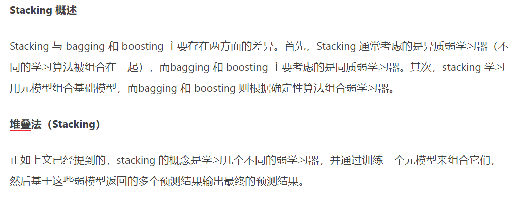

## Bagging和Boosting的区别：
* 1）样本选择上：Bagging：训练集是在原始集中**有放回**选取的，从原始集中选出的各轮训练集之间是独立的。Boosting：每一轮的训练集不变，只是训练集中每个样例在分类器中的权重发生变化。而权值是根据上一轮的分类结果进行调整。

* 2）样例权重：Bagging：使用均匀取样，每个样例的权重相等。Boosting：根据错误率不断调整样例的权值，错误率越大则权重越大。

* 3）**预测函数：Bagging：所有预测函数的权重相等**。Boosting：每个弱分类器都有相应的权重，对于分类误差小的分类器会有更大的权重。

* 4）并行计算：Bagging：各个预测函数可以并行生成。Boosting：各个预测函数只能顺序生成，因为后一个模型参数需要前一轮模型的结果。

第2、3点是针对Adaboost算法。事实上Boosting包括其他算法像GBDT\XGBoost等，1，4点才是Bagging 和 Boosting的本质区别。一个是训练集采样的方法；一个是并行计算是否可以。

### 一种理解Bagging和Boosting的数学本质是:
#### Bagging减少模型的方差

#### Boosting减少模型的偏差

## Blending 与 Stacking
* Blending：用不相交的数据训练不同的 Base Model，将它们的输出取（加权）平均。实现简单，但对训练数据利用少了。

**元模型（或称替代模型）是“模型的模型”** ,元建模则指建立元模型的过程（meta-physics 为”形而上学“，即“科学的科学”）。